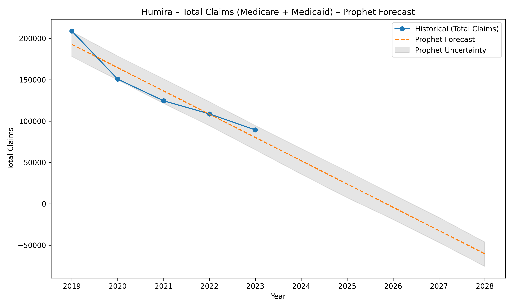
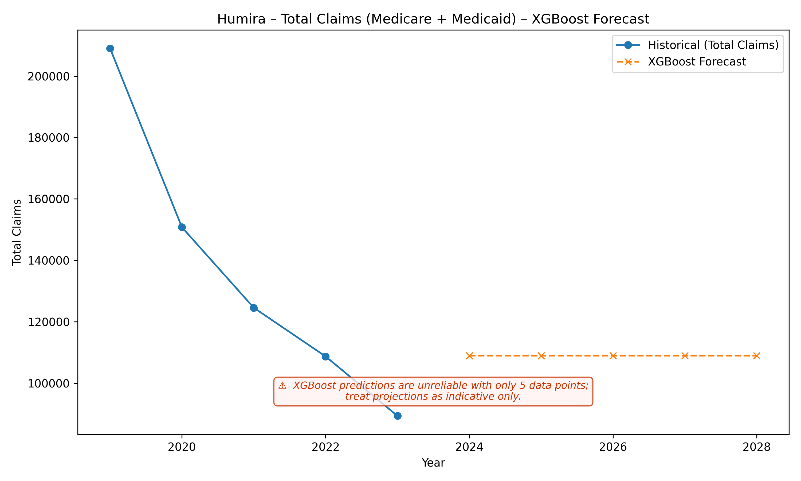

# Humira Patient Demand Forecasting (Medicare + Medicaid)

This project builds a complete, end‑to‑end forecasting pipeline to analyze and predict **Humira (adalimumab)** patient demand trends across U.S. Medicare Part D and Medicaid programs.  
It is designed as a clean, modular, interview‑ready project showcasing:

- Healthcare data analysis  
- Time‑series forecasting  
- Prophet & XGBoost modeling  

---

## 📌 Project Overview

Humira is one of the highest‑spending biologics in the U.S. healthcare system.  
This project analyzes annual drug utilization and spending data from Medicare Part D and Medicaid, then builds forecasting models to estimate future patient demand.

The pipeline includes:

- Data ingestion (Medicare Part D + Medicaid annual datasets)
- Data transformation (wide → long time‑series)
- Demand metric construction (Total Claims)
- Prophet forecasting (5‑year horizon)
- XGBoost forecasting (5‑year horizon)
- Visualization (PNG charts for GitHub & PowerBI)
- Modular Python code under `src/`

## 📊 Example Forecast Results

### Prophet Forecast  

### XGBoost Forecast  

## 📁 Project Structure

humira-forecast/

│

├─ data/

│   ├─ Medicare_Part_D_Spending_by_Drug_2023.csv

│   ├─ Medicaid_Spending_by_Drug_2023.csv

│

├─ outputs/

│   ├─ humira_prophet_forecast.png

│   ├─ humira_xgboost_forecast.png

│
├─ src/

│   ├─ humira_forecast.py

│

├─ notebooks/

│   ├─ 01_explore_humira.ipynb

│

├─ README.md

├─ requirements.txt

## 🧠 Data Sources

All datasets come from CMS (Centers for Medicare & Medicaid Services):

- Medicare Part D Drug Spending by Drug (Annual)
- Medicaid Drug Spending by Drug (Annual)

These datasets include:

- Total Claims  
- Total Spending  
- Total Dosage Units  
- Beneficiary Count  
- Weighted Average Spending per Unit  
- Manufacturer Information  

---

## 🔧 Tech Stack

| Component | Technology |
|----------|------------|
| Language | Python 3.13 |
| Data Processing | pandas 2.2 |
| Forecasting | Prophet, XGBoost |
| Visualization | matplotlib |
| Project Structure | Modular `src/` layout |
| Output | PNG charts (GitHub‑friendly) |

---

## 📈 Forecasting Methods

### 1. Prophet (Additive Time‑Series Model)
Used for long‑term trend forecasting.  
Seasonality disabled because CMS annual data does not include quarterly granularity.

### 2. XGBoost (Gradient Boosted Regression)
Used for non‑linear trend modeling and robustness checks.

Both models predict total annual claims for Humira across Medicare + Medicaid.

---

## ▶️ Disclaimer

The analysis is based on publicly available government data. All rights to the underlying data belong to the original source. The interpretations and conclusions expressed herein are solely those of the author and do not imply any endorsement or opposition regarding any company or product. This content is for learning and non-commercial purposes only and does not constitute medical or professional advice.

